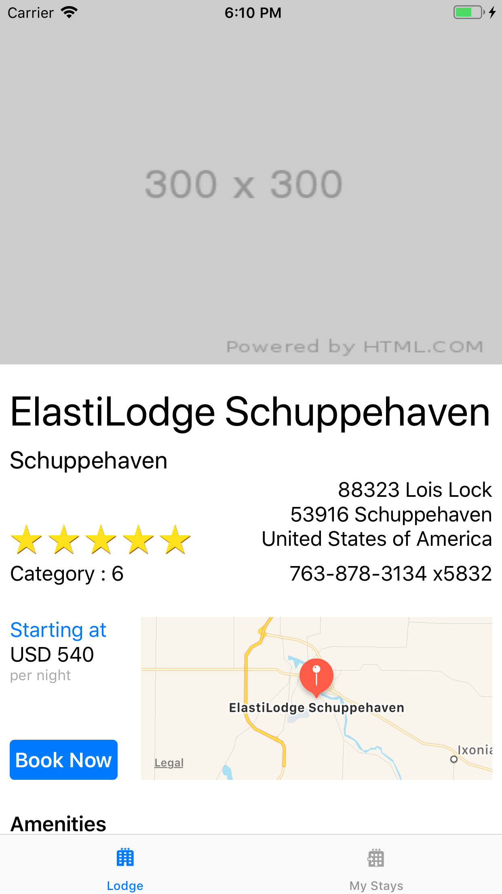

# Initializing iOS projects.

**Requirements** 

- [AWS Amplify installed](https://aws-amplify.github.io/docs/) and configured with administrator permissions (`npm install -g @aws-amplify/cli && amplify configure`)

- [XCode](https://developer.apple.com/xcode/)

- [CocoaPods](https://cocoapods.org/) : `sudo gem install cocoapods`

- Be sure to deploy the App Sync backend, by following [these instructions](README.backend.md)

## Adding the backend dependencies to your project

The instructions have to be repeated for each phases : phase-1, phase-2 and phase-3 

### Initialize amplify

```bash 
$ cd ios/phase-1

$ amplify init 
```

Choose your own text editor, choose `ios`, your AWS profile.  Output should be like this :

```
Note: It is recommended to run this command from the root of your app directory
? Choose your default editor: Sublime Text
? Choose the type of app that you're building ios
Using default provider awscloudformation

For more information on AWS Profiles, see:
https://docs.aws.amazon.com/cli/latest/userguide/cli-multiple-profiles.html

? Do you want to use an AWS profile? Yes
? Please choose the profile you want to use amplify
⠼ Initializing project in the cloud...
```

### Generate the code for the frontend

```
$ API_ID=$(aws appsync list-graphql-apis --query "graphqlApis[? name == 'ElastiLodgeApi'].apiId" --output text)

$ amplify add codegen --apiId $API_ID
```

Accept all the defaults:

```
✔ Getting API details
Successfully added API ElastiLodgeApi to your Amplify project
? Enter the file name pattern of graphql queries, mutations and subscriptions graphql/**/*.graphql
? Do you want to generate/update all possible GraphQL operations - queries, mutations and subscriptions Yes
? Enter the file name for the generated code API.swift
? Do you want to generate code for your newly created GraphQL API Yes
✔ Downloaded the schema
✔ Generated GraphQL operations successfully and saved at graphql
✔ Code generated successfully and saved in file API.swift
```

Then prepare the XCode project :

```
$ mv API.swift GeneratedAPI.swift

$ pod install
Analyzing dependencies
Downloading dependencies
Installing AWSAppSync (2.10.1)
Installing AWSCore (2.8.4)
Installing ReachabilitySwift (4.3.0)
Installing SQLite.swift (0.11.5)
Generating Pods project
Integrating client project
Sending stats
Pod installation complete! There are 2 dependencies from the Podfile and 4 total pods installed.

$ open ElastiLodge.xcworkspace
```

Build and Run ... it should work :-) Here is a screenshot of the app



### Update the API 

Should you update the schema or the API on the serv side, just type:

```
$ amplify codegen

$ mv API.swift GeneratedAPI.swift
```

## Cleanup 

To delete Amplify's server side resources, type :

```
$ amplify delete
```